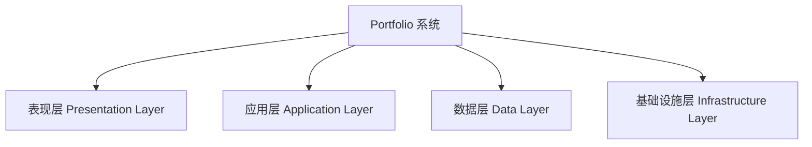
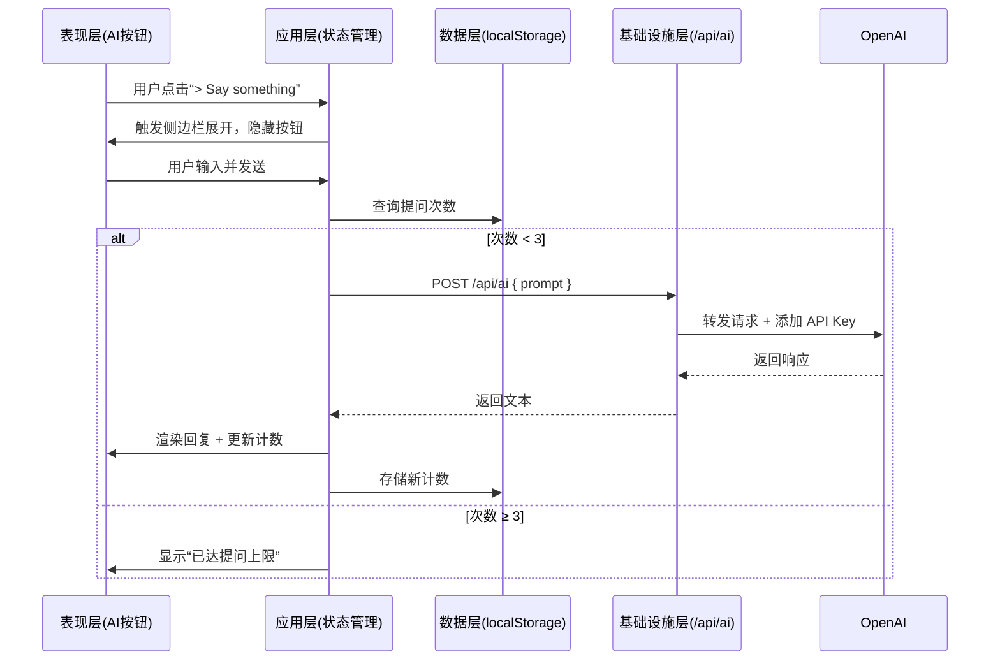

# 🏗️ Portfolio 网站架构设计文档 v1.0（自顶向下 · 模块化拆分）

## —— 以系统思维重构产品结构

---

## 一、总体架构原则

- **静态优先**：内容以静态生成为主，提升加载速度与 SEO
- **前后分离**：前端专注 UI 与交互，后端仅提供必要 API
- **模块自治**：各功能模块高内聚、低耦合，便于独立迭代
- **安全隔离**：敏感逻辑（如 AI 调用）置于服务端，避免泄露
- **渐进增强**：基础功能离线可用，高级功能按需加载

---

## 二、系统层级划分（自顶向下）

---

## 三、模块拆分与职责定义

### 3.1 表现层（Presentation Layer）

> 负责用户可见界面与交互响应
> 

| 模块 | 职责 | 技术实现 |
| --- | --- | --- |
| **UI 主界面** | 展示 About、Projects、Stats 等内容 | React 组件 + Tailwind CSS |
| **AI 助手交互界面** | 提供聊天输入、历史展示、关闭控制 | React State 管理对话流 |
| **语言与主题 UI** | 提供切换控件，响应用户操作 | Context + 动态 class 绑定 |
| **响应式适配** | 适配桌面、平板、手机不同布局 | CSS Media Queries + Flex/Grid |

> ✅ 输出：组件树、布局结构、动效定义
> 

---

### 3.2 应用层（Application Layer）

> 负责业务逻辑编排与状态协调
> 

| 模块 | 职责 | 技术实现 |
| --- | --- | --- |
| **状态管理** | 统一管理语言、主题、AI 对话记录 | React Context + localStorage 持久化 |
| **AI 交互流程控制** | 控制提问次数（3 次限制）、会话生命周期 | 内存状态 + localStorage 计数 |
| **路由与导航** | 页面跳转、锚点定位（如有） | Next.js App Router |
| **事件总线** | 解耦组件间通信（如“打开 AI 面板”事件） | 自定义事件或 useReducer |

> ✅ 输出：状态机、交互流程图、API 调用时机
> 

---

### 3.3 数据层（Data Layer）

> 负责数据获取、组织与本地缓存
> 

| 模块 | 职责 | 数据源 | 更新机制 |
| --- | --- | --- | --- |
| **静态内容模块** | 提供 About Me、项目列表等结构化数据 | `constants.json` 或 TS 对象 | 手动维护 |
| **国际化数据** | 提供中英文文案映射 | `i18n/en.json`, `i18n/zh.json` | 静态文件 |
| **GitHub 数据** | 展示 Stars、Commits 等统计 | 外链图片 `github-readme-stats` | 自动同步，无需本地存储 |
| **用户偏好数据** | 存储语言、主题、AI 提问次数 | `localStorage` | 用户操作触发写入 |

> ✅ 输出：数据结构定义、加载策略、缓存规则
> 

---

### 3.4 基础设施层（Infrastructure Layer）

> 负责外部依赖与安全代理
> 

| 模块 | 职责 | 技术实现 |
| --- | --- | --- |
| **AI 服务代理** | 安全调用 LLM API，防止密钥泄露 | Vercel Edge Function (`/api/ai`) |
| **部署与 CDN** | 全球加速、静态资源托管 | Vercel 部署，自动 CI/CD |
| **访问控制** | 限制 AI 提问频率 | 基于 `localStorage` 的轻量限流 |
| **日志与监控**（可选） | 记录异常、用户行为 | Vercel Analytics 或自建轻量埋点 |

> ✅ 输出：API 接口定义、部署流程、安全策略
> 

---

## 四、核心交互流程（跨模块协作）

### AI 助手完整调用链（自顶向下）

---

## 五、模块依赖关系

| 模块 | 依赖模块 | 说明 |
| --- | --- | --- |
| 表现层 | 应用层、数据层 | 获取状态与内容 |
| 应用层 | 数据层、基础设施层 | 读写数据、调用 API |
| 数据层 | 无 | 仅提供数据读写接口 |
| 基础设施层 | 无 | 对外代理，独立运行 |

> ⚠️ 禁止反向依赖：上层可调用下层，下层不得感知上层。
> 

---

## 六、关键技术决策

| 决策项 | 方案 | 理由 |
| --- | --- | --- |
| 是否使用数据库 | ❌ 否 | 个人站数据静态，无需后端存储 |
| AI 是否前端直连 | ❌ 否 | 存在 API Key 泄露风险 |
| 主题切换实现 | ✅ CSS Variables + class 切换 | 高性能，支持 SSR |
| 多语言实现 | ✅ JSON 文件 + Context | 轻量，易维护 |
| 构建方式 | ✅ SSG（静态生成） | 提升首屏性能与 SEO |

---

## 七、扩展性预留

| 未来需求 | 扩展方式 |
| --- | --- |
| 添加博客 | 在表现层新增 `BlogModule`，数据层增加 Markdown 解析 |
| 项目详情页 | 新建 `ProjectDetailModule`，独立路由 |
| 用户登录 | 在基础设施层接入 Auth0/Firebase，应用层增加 auth 状态 |
| 对话历史保存 | 引入轻量数据库（如 Supabase），扩展数据层 |
