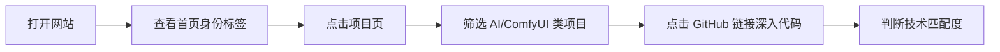
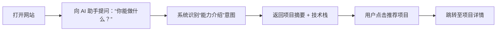
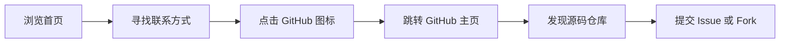

# 🧩 Portfolio 产品设计 v1.0（功能解耦版）

## 一、核心功能模块划分

| 模块 | 职责 | 输入 | 输出 |
| --- | --- | --- | --- |
| **首页中枢** | 身份表达 + 导航入口 | 用户访问 | 展示身份、数据、导航路径 |
| **项目系统** | 技术能力可视化 | 项目元数据（JSON） | 项目卡片列表 |
| **简历系统** | 在线化职业履历 | 简历结构化数据 | 可读、可搜、可交互的简历 |
| **AI 助手** | 自然语言交互路由 | 用户提问 | 文本回复 + 页面跳转建议 |
| **数据看板** | 动态 GitHub 指标展示 | GitHub API | Stars / Commits / PRs / 最近活跃时间 |
| **源码公开** | 信任背书与开放协作 | 静态链接 | 外链至 GitHub 仓库 |

---

## 二、用户旅程地图（User Journey Map）

### 场景 1：技术招聘官访问



> ✅ 产品目标：降低评估成本，提升技术可信度
> 

---

### 场景 2：潜在合作方咨询



> ✅ 产品目标：实现无值守智能引导
> 

---

### 场景 3：访客想联系作者



> ✅ 产品目标：建立开放协作入口
> 

---

## 三、AI 助手交互逻辑（状态机模型）

```json
{
  "states": [
    "idle",
    "listening",
    "processing",
    "responding",
    "rate_limited"
  ],
  "rules": [
    {
      "trigger": "点击助手按钮",
      "from": "idle",
      "to": "listening",
      "action": "显示欢迎语"
    },
    {
      "trigger": "提交问题",
      "from": "listening",
      "to": "processing",
      "action": "调用意图识别"
    },
    {
      "intent": "项目查询",
      "response": "列出相关项目标题与链接",
      "next": "listening"
    },
    {
      "intent": "自我介绍",
      "response": "输出职业标签与核心技能",
      "next": "listening"
    },
    {
      "intent": "联系方式",
      "response": "展示社交图标说明",
      "next": "listening"
    },
    {
      "intent": "自由对话",
      "check": "提问次数 < 3",
      "response": "LLM 生成回应",
      "next": "listening",
      "else": {
        "to": "rate_limited",
        "message": "每位访客最多提问3次"
      }
    }
  ]
}

```

---

## 四、数据依赖与更新机制

| 数据项 | 来源 | 更新频率 | 缓存策略 |
| --- | --- | --- | --- |
| GitHub Stars | GitHub API (`/repos/{user}/{repo}`) | 每小时 | CDN 缓存 + localStorage |
| Commit 总数 | GitHub API (`/repos/{user}/{repo}/commits`) | 每日 | 服务端定时拉取 |
| PR 提交数 | GitHub API (`/search/issues?q=author:...+type:pr`) | 每日 | 同上 |
| 最近提交时间 | GitHub API | 实时查询 | 本地缓存 1 小时 |
| 项目元数据 | `projects.json` 静态文件 | 手动更新 | Git 提交触发 |

---

## 五、权限与限制规则

| 功能 | 访问控制 | 限制条件 |
| --- | --- | --- |
| AI 助手提问 | 匿名访问 | 每设备最多 3 条（localStorage 计数） |
| 源码仓库访问 | 公开 | 无限制 |
| 项目外链跳转 | 公开 | 新标签页打开，防跳出 |
