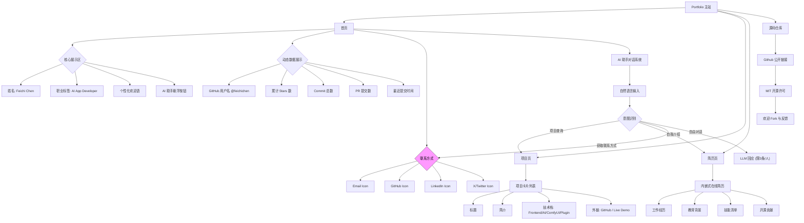

# **📄 Portfolio 网站产品需求文档（PRD v1.0）**

> 产品名称：Feichi Chen's AI-First Portfolio
> 
> 
> **版本号**：v1.0
> 
> **作者**：Edison（产品经理）
> 
> **目标用户**：创业者、技术主管（Tech Lead）、潜在合作者
> 
> **发布日期**：2025年4月5日
> 
> **状态**：MVP 定义完成
> 

---

## **一、产品概述**

### **1.1 产品愿景**

打造一个以 **AI 原生体验为核心** 的开发者个人品牌门户，突出前端开发 + AI 应用构建能力（ComfyUI 工作流、插件开发、开源贡献），实现智能化内容交互与动态可信度展示。

### **1.2 核心价值主张**

| **维度** | **价值点** |
| --- | --- |
| ✨ 个性表达 | 高辨识度 UI + 个性化欢迎语 |
| 🔍 智能导航 | 自然语言提问 → 自动跳转项目或回答经历问题 |
| 🤖 AI 助手 | 支持自由对话、简历问答、项目推荐 |
| 🧬 动态可信 | 实时 GitHub 数据更新，展现活跃度 |
| 🎨 视觉美学 | Catppuccin 主题配色（Mocha/Macchiato），填充图标 + 微动效 |

---

## **二、用户画像**

| **角色** | **特征** | **使用场景** |
| --- | --- | --- |
| 创业者 | 寻找靠谱技术合伙人 | “他有没有做过端到端的 AI 应用？” |
| 技术主管 | 考察候选人工程能力 | “他的开源项目质量如何？是否积极参与社区？” |
| 合作者 | 探索协同可能性 | “我能和他一起做 ComfyUI 插件吗？” |

---

## **三、功能需求清单（按模块划分）**

### **3.1 L1: 核心身份表达**

| **编号** | **功能描述** | **类型** | **优先级** | **备注** |
| --- | --- | --- | --- | --- |
| L1-01 | 姓名与职业标签展示 | 展示 | P0 | `Feichi Chen AI App Developer` |
| L1-02 | 在线简历呈现（内嵌页面） | 展示 | P0 | Markdown 渲染，支持锚点跳转 |
| L1-03 | 联系方式公开（邮箱/GitHub/LinkedIn/X） | 交互 | P0 | 图标使用 **Catppuccin Mocha/Macchiato** 配色，填充风格，悬停微动效（scale 1.1） |
| L1-04 | 浅色/深色主题切换 | 交互 | P0 | 默认跟随系统，可手动切换 |
| L1-05 | 个性化欢迎语 | 展示 | P1 | “你好呀，来自 GitHub 的朋友！”（基于 referrer 检测） |

---

### **3.2 L2: 内容组织结构**

| **编号** | **功能描述** | **类型** | **优先级** | **备注** |
| --- | --- | --- | --- | --- |
| L2-01 | 项目卡片展示 | 展示 | P0 | 包含标题、简介、技术栈（前端/AI/ComfyUI/插件）、外链按钮 |
| L2-02 | 项目链接自动注入 | 数据 | P0 | 所有项目必须提供 GitHub/Live Demo 链接 |

> ⚠️ 排除项：分类筛选、博客模块、归档页 —— 当前阶段不实现
> 

---

### **3.3 L3: 动态数据集成**

| **编号** | **功能描述** | **类型** | **优先级** | **实现方式** |
| --- | --- | --- | --- | --- |
| L3-01 | 展示 GitHub 用户名 | 展示 | P0 | `@feichichen` |
| L3-02 | 展示累计 Stars 数 | 展示 | P0 | 来自所有公开仓库汇总 |
| L3-03 | 展示 Commit 总数 | 展示 | P0 | GitHub API 聚合统计 |
| L3-04 | 展示 PR 提交数（opened） | 展示 | P0 | 反映开源参与度 |
| L3-05 | 最近提交时间提示 | 展示 | P0 | “最近活跃：3 天前” |
| L3-06 | GitHub 数据每日更新 | 自动化 | P0 | 通过 GitHub Actions 定时拉取并缓存 |

```
<YAML>

# 示例：GitHub Action 更新流程on:  schedule:    - cron: '0 0 * * *'# 每天 UTC 00:00 执行jobs:  fetch_github_data:    runs-on: ubuntu-latest    steps:      - name: Fetch stats via Starlight        run: npx starlight-cli --user feichichen --output public/data/github.json      - name: Deploy to Vercel        run: vercel --prod

```

---

### **3.4 L4: AI 原生体验**

| **编号** | **功能描述** | **类型** | **优先级** | **实现说明** |
| --- | --- | --- | --- | --- |
| L4-01 | AI 助手入口（悬浮按钮） | 交互 | P0 | 固定在右下角，点击展开聊天框 |
| L4-02 | 支持项目问答 | 对话 | P0 | “说说你做的 ComfyUI 插件” → 返回摘要 + 链接 |
| L4-03 | 支持自然语言导航 | 导航 | P0 | “看看 AI 相关项目” → 自动跳转至对应项目区域 |
| L4-04 | 支持自由对话（限制 3 条/人） | 对话 | P0 | 使用 LLM 构建 persona：“我是 Feichi，一名 AI 应用开发者” |
| L4-05 | 介绍本人经历与技能 | 对话 | P0 | 替代传统“About Me”文本块 |
| L4-06 | 内容摘要自动生成 | 辅助 | P1 | 使用 LLM 为每个项目生成一句话亮点（部署时预生成） |
| L4-07 | AI 推荐排序优化 | 分析 | P2 | 基于访问数据建议首页项目顺序（后续迭代） |

> 💡 LLM 实现建议：
> 
> - 使用 **Vercel AI SDK** + **OpenRouter** 或 **Anthropic Claude 3 Sonnet**
> - 提示词模板固化角色人格与知识边界
> - 对话上下文本地存储（localStorage），限制每人最多 3 次提问（防滥用）

---

### **3.5 L5: 可信度与透明度**

| **编号** | **功能描述** | **类型** | **优先级** | **备注** |
| --- | --- | --- | --- | --- |
| L5-01 | 开源源码仓库链接 | 展示 | P0 | 页脚提供 GitHub 链接，鼓励 Fork 学习 |
| L5-02 | 自动生成 sitemap.xml | SEO | P0 | 提升搜索引擎收录 |
| L5-03 | 自动生成 feed.xml（RSS） | SEO | P0 | 便于技术读者订阅更新 |

> ⚠️ 排除项：技术栈声明、Lighthouse 分数 —— 不展示
> 

---

### **3.6 L6: 可定制性与扩展性**

| **编号** | **功能描述** | **类型** | **优先级** | **实现方式** |
| --- | --- | --- | --- | --- |
| L6-01 | 自定义域名绑定 | 配置 | P0 | 支持 `feichichen.dev` 或类似 |
| L6-02 | Meta & Open Graph 设置 | SEO | P0 | 每页设置 title/description/image，提升分享体验 |
| L6-03 | 内建访问统计 | 分析 | P0 | 使用 Plausible（隐私友好），监测来源、设备、页面停留 |

> ⚠️ 排除项：CMS（如 Sanity）—— 当前采用代码管理内容，由 GitHub Action 每日触发构建
> 

---

### **3.7 L7: 可访问性与包容性**

| **编号** | **功能描述** | **类型** | **优先级** | **符合标准** |
| --- | --- | --- | --- | --- |
| L7-01 | 键盘导航支持 | UX | P0 | Tab 可达，焦点高亮可见 |
| L7-02 | 屏幕阅读器兼容 | UX | P0 | 使用 `<nav>`, `<main>`, `aria-label` 等语义化标签 |

> ⚠️ 排除项：“减少动画”开关 —— 保留微动效，但确保不会引发不适
> 

---

## **四、非功能性需求**

| **类别** | **要求** |
| --- | --- |
| **性能** | LCP < 1.5s, FID < 100ms（Vercel + Next.js SSG 保障） |
| **SEO** | 支持 SSR/SSG，sitemap + meta 全覆盖 |
| **安全性** | 不收集用户数据，AI 对话上下文仅存在 localStorage |
| **可维护性** | 所有内容基于 Markdown 和 JSON，可通过 CI/CD 自动更新 |
| **可扩展性** | 模块化设计，未来可接入博客、CMS、Newsletter |

---

## **五、下一步交付计划**

| **阶段** | **输出物** | **时间估算** |
| --- | --- | --- |
| 1 | 信息架构图（IA） + 页面线框图 | 1 天 |
| 2 | MVP 技术架构图（含 AI 集成路径） | 1 天 |
| 3 | 视觉设计规范（Catppuccin 主题应用） | 2 天 |
| 4 | 开发任务拆解（GitHub Issue Template） | 1 天 |


